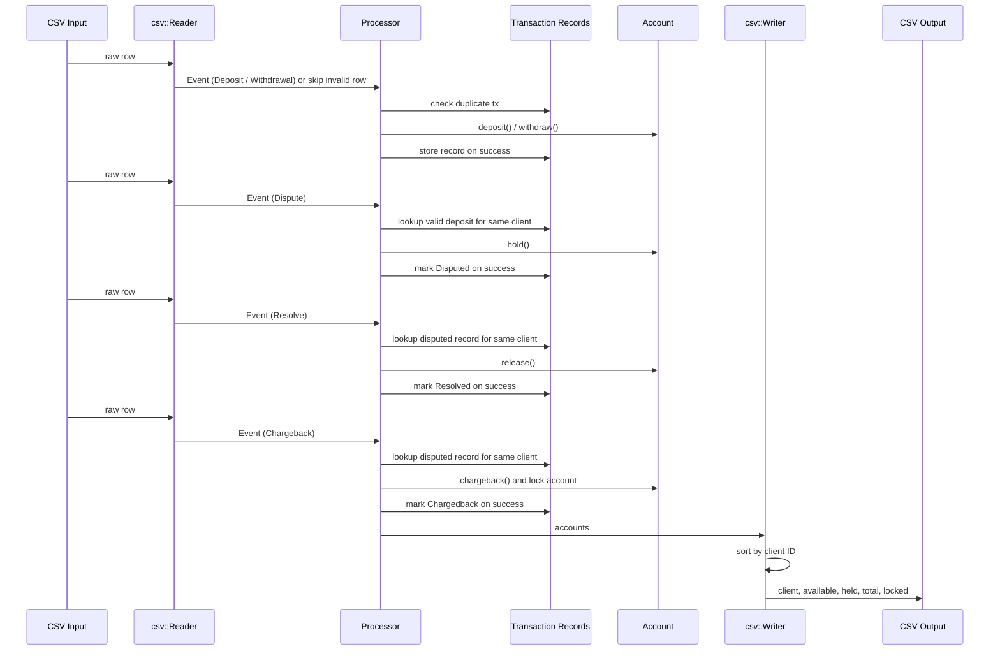

# Themis

> In Greek mythology, Themis is the goddess of justice, law, and divine order — the keeper of rules that cannot be broken.

Themis is a financial transaction processor. It reads a stream of transaction events from a CSV file, applies them to client accounts, and outputs the resulting account state. Like its namesake, it enforces rules that cannot be bent: a locked account stays locked, a withdrawal dispute is ignored, a chargeback that leaves a balance negative is still recorded faithfully.

## Usage

```bash
cargo run -- transactions.csv
```

Output is written to stdout as CSV.

## Input format

A CSV file with the following columns:

| Column   | Type    | Description                        |
|----------|---------|------------------------------------|
| `type`   | string  | `deposit`, `withdrawal`, `dispute`, `resolve`, `chargeback` |
| `client` | u16     | Client ID                          |
| `tx`     | u32     | Transaction ID (globally unique)   |
| `amount` | f64     | Amount (up to 4 decimal places); omitted for dispute/resolve/chargeback |

Example:

```csv
type,client,tx,amount
deposit,1,1,100.0
withdrawal,1,2,30.0
dispute,1,1,
resolve,1,1,
```

## Output format

A CSV with one row per client:

| Column      | Description                              |
|-------------|------------------------------------------|
| `client`    | Client ID                                |
| `available` | Funds available for withdrawal           |
| `held`      | Funds held under dispute                 |
| `total`     | `available + held`                       |
| `locked`    | `true` if account was charged back       |

## Rules

- Duplicate transaction IDs are silently ignored.
- Only deposits can be disputed — disputes on withdrawals are ignored.
- Disputes, resolves, and chargebacks must reference a transaction belonging to the same client.
- Operations on locked accounts are silently ignored.
- A chargeback after a withdrawal can result in a negative balance — the account owes the bank.

## Architecture



## Development

```bash
cargo test       # run all tests
cargo clippy     # lint
cargo fmt        # format
```

## AI Disclosure

AI tools used: OpenAI Codex and Anthropic Claude.

They were used as pair-programming and review aids to sanity-check
implementation details, review documentation, and help surface edge cases and
wording issues. Final technical decisions, validation, and submitted changes
were my own.
