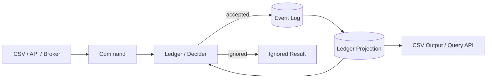
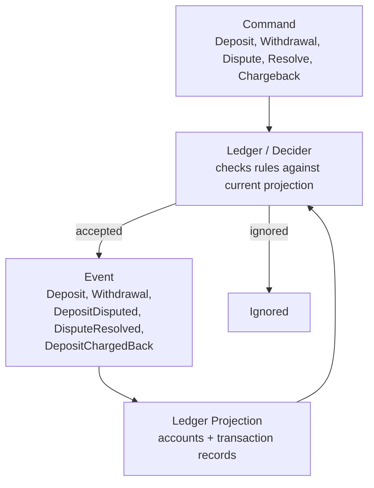
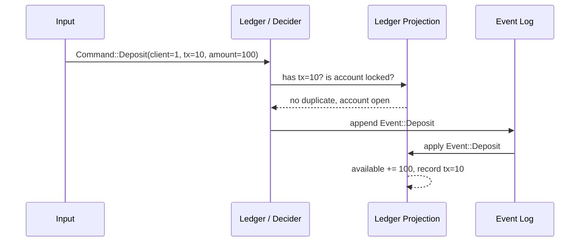

# Event Sourcing Architecture

This is the simplified target architecture for Themis.

The important distinction is:

- a `Command` is a request to do something;
- an `Event` is a fact Themis accepted;
- a `Projection` is state rebuilt from accepted events.

Themis should first implement this in memory. Durable streams, brokers, and
external databases can come later.

## Simple Flow



In words:

```text
Command -> decide -> Event -> project -> Account state
```

## Themis Parts



The `Ledger` should answer one question:

```text
Given this command and the current ledger projection,
which accepted event should happen, if any?
```

The projection should answer a different question:

```text
Given this accepted event,
how does account and transaction state change?
```

## Example



## Current Implementation

The external input type is `Command`, and accepted ledger facts are `Event`s:

```rust
pub enum Event {
    Deposit { client, tx, amount },
    Withdrawal { client, tx, amount },
    DepositDisputed { client, tx, amount },
    DisputeResolved { client, tx, amount },
    DepositChargedBack { client, tx, amount },
}
```

`Ledger::apply(command)` now follows this shape:

```text
decide command
if accepted:
  append accepted event
  apply accepted event to projection
else:
  return Ignored
```

## What We Are Not Building Yet

Do not add Kafka, Redpanda, NATS, Postgres, or RocksDB yet.

Do not split account and transaction projections yet.

Do not optimize for multiple projection consumers yet.

The first goal is only this:

```text
Commands are requests.
Events are accepted facts.
Ledger state is a projection from accepted facts.
```
